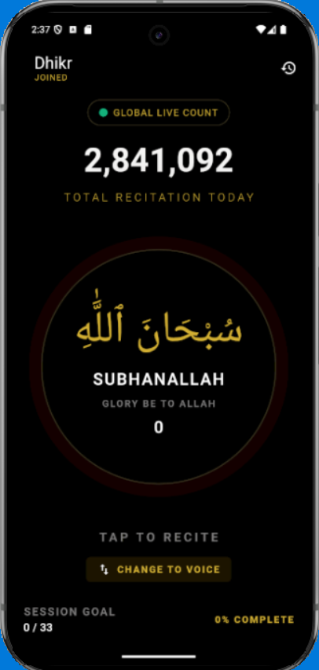

# dhikr_sample
A Flutter project to display simple counter using Riverpod state management.

## Table of Contents
- [Installation versions](#installation-versions)
- [Dependencies](#dependencies)
- [Features](#features)
  - [Counter/HomeScreen](#counter-homescreen)
- [Run The Project](#run-the-project)
  - [Prerequisites](#prerequisites)
- [Architecture](#architecture)
  - [General Architecture](#general-architecture)
  - [Folder Structure](#folder-structure)
- [State Management](#state-management)
  - [Riverpod](#riverpod)

## Installation versions
- Flutter 3.41.2 (Channel stable)
- Dart 3.11.0
- Android SDK version 36.0.0
- Emulator version 36.4.9.0
- Platform android-36.1
- build-tools 36.0.0
- Java version OpenJDK Runtime Environment (build 21.0.6)
- Windows Version (Windows 11, 25H2)

## Dependencies
- [flutter_riverpod: 3.3.1](https://pub.dev/packages/flutter_riverpod/versions/3.3.1)

## Features
### Counter/HomeScreen

In this screen, the user may tap on a part of the screen that will increase a counter until a specified limit. The counter increment and progress will be shown dynamically. The counter state changes will be managed by riverpod state management system.

A reference UI design is implemented for accuracy. Here is a side by side comparison between the provided design and actual implementation.
<table align="center">
  <tr>
    <td align="center">
      <br/>
      <em>Figure 1: Reference design</em>
    </td>
    <td align="center">
      <br/>
      <em>Figure 2: Implemented/Developed screen</em>
    </td>
  </tr>
</table>

## Run The Project
### Prerequisites
Make sure you have the following installed:
 - Flutter SDK
 - Android SDK
 - Android Studio or VS Code
 - Android Emulator or Physical Android Device

Open the terminal and input 
```bash
flutter doctor -v
```
Resolve any issues shown before continuing.

Install dependencies using
```bash
flutter pub get
```
This will download all required packages.
To run the application, first launch an android emulator. Then, in the terminal, write
```bash
flutter run -d <device_id>
```

Or you can simply choose the <b>Run without debugging</b> option from VsCode menu.  
Or you can use CTRL + F5 (For Windows) and CMD + Fn + F5 (For MacOs) shortcuts to run the app. 

## Architecture
### General Architecture
This project uses general structure of clean architecture (layered architecture).
```text
├── data
│   ├── models
│   ├── datasources
│   │   ├── remote
│   │   └── local
│   └── repositories
│
├── domain
│   ├── entities
│   ├── repositories
│   └── usecases
│
└── presentation
    ├── screens
    ├── widgets
    └── controllers (State Management)
```

### Folder Structure
This is the folder structure of this project.
```text
lib
├── core
│   ├── theme
│   └── widgets
│
├── features
│   └── home
│       ├── data
│       ├── domain
│       └── presentation
│           ├── screens
│           ├── widgets
│           └── riverpod
│
├── pubspec.yaml
└── main.dart
```

## State Management
### Riverpod
Riverpod state management is used to handle state changes in this app. Since this app has a simple counter, only a <i>Notifier</i> of type <i>int</i> is used.  
The initial value is set at 0 since counting starts from zero.  
The controller has two methods to increase count by setting state and to reset the state back to zero.  
I added a reset button on the right side of the appbar to reset the count.  
I also removed the back navigation button in appbar since this is a single page application